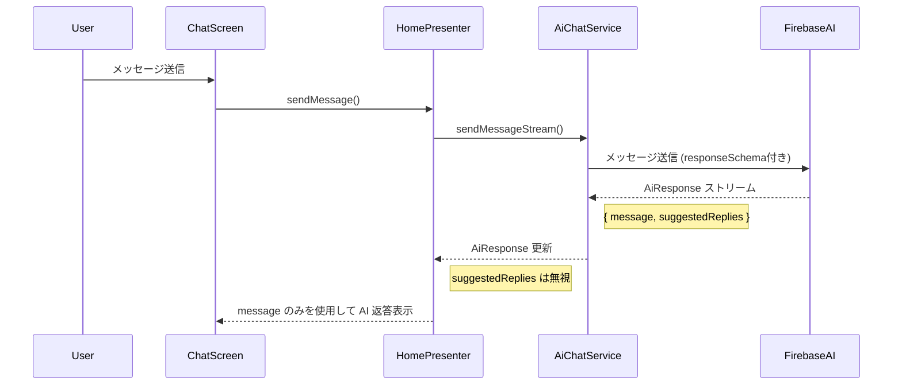
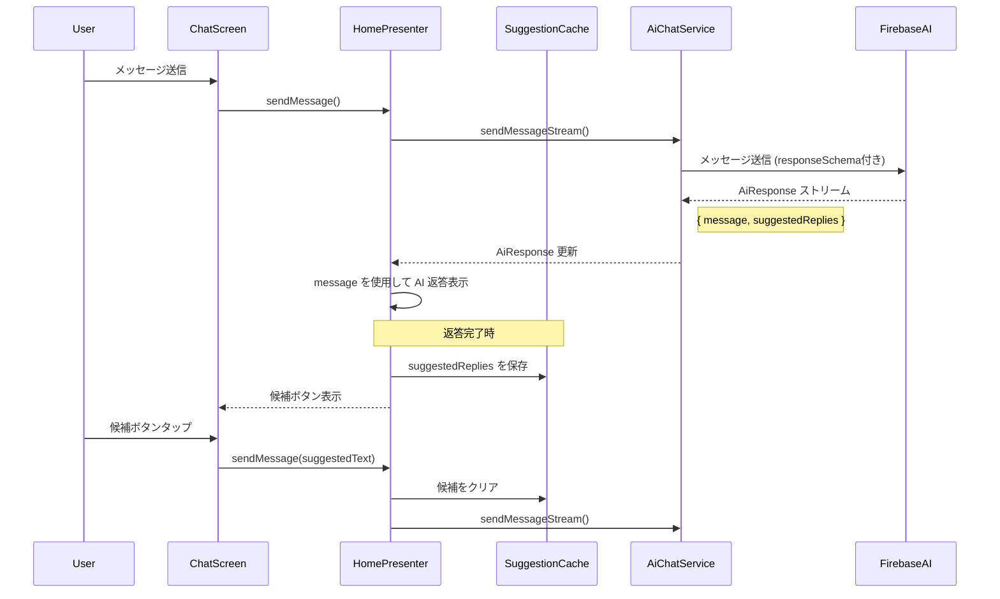

## Overview

AI からの返答表示時に、ユーザーが次に送信しそうな質問や返答を予測し、画面にボタンとして表示する機能を追加する。これにより、ユーザーは提案されたボタンをタップするだけで次のメッセージを送信できるようになり、対話がよりスムーズになる。

### Background and Purpose

**背景:**

- 現在、チャット開始時には静的な質問例が表示されているが、会話が始まった後は手動でテキスト入力する必要がある
- ユーザーが次に何を聞けばよいか迷う場合がある
- モバイルデバイスでのテキスト入力は煩わしい場合がある

**解決したい課題:**

- ユーザーの対話体験を向上させ、会話を継続しやすくする
- テキスト入力の手間を減らし、よりスムーズな対話フローを実現する
- AI が文脈を理解した上で適切な次の質問を提案することで、対話の質を向上させる

### Expected Impact

- ユーザーのメッセージ送信率の向上（特に 2 往復目以降の会話継続率）
- 平均対話ターン数の増加
- テキスト入力による摩擦の軽減

### Feature Description

AI がメッセージを送信した直後に、会話の文脈を分析して次に予想される質問や返答を 3〜5 個生成し、チャット画面の下部にボタンとして表示する。ユーザーがボタンをタップすると、その内容がメッセージとして送信される。

**主要な機能要件:**

1. AI の返答完了時に、文脈に基づいて次の質問候補を自動生成
2. 生成された候補を横スクロール可能なボタンとして表示
3. ボタンタップで即座にメッセージとして送信
4. 候補生成中はローディング状態を表示
5. 生成エラー時は候補は非表示

## User Stories

- As a ユーザー, I want AI の返答後に関連する質問候補が表示される so that 次に何を聞けばよいかわかり、スムーズに会話を続けられる
- As a ユーザー, I want 候補ボタンをタップするだけでメッセージを送信できる so that テキスト入力の手間を省いて素早く返信できる
- As a ユーザー, I want 複数の質問候補から選択できる so that 自分の興味に合った方向で会話を展開できる
- As a 開発者, I want 候補生成ロジックを AI 側に持たせる so that 文脈を考慮した高品質な候補を生成できる

## Implement Issue List

### Phase 1: Response Schema の変更（返答サジェスト対応の基盤整備）

このフェーズでは、AI の返答と同時に返答サジェストを受け取れるように Response Schema を変更します。ただし、この段階では受け取ったサジェストを利用せず、内部的な構造変更のみを行います。

#### Frontend - Data Layer (Phase 1)

- [ ] `AiResponse` モデルの実装
  - AI からの構造化された返答を表現する Freezed モデル
  - `message` (String): AI の返答メッセージ
  - `suggestedReplies` (List\<String\>): 返答サジェストのリスト（3〜5 個）
  - JSON デシリアライゼーション対応

- [ ] `AiChatService` の Response Schema 対応
  - `GenerationConfig` に `responseSchema` を追加
  - `responseMimeType` を `application/json` に設定
  - JSON Schema の定義（`message` と `suggestedReplies` フィールド）
  - `sendMessageStream` の返り値を `Stream<String>` から `Stream<AiResponse>` に変更
  - ストリーミング中は `suggestedReplies` を空リストとして扱う

- [ ] `HomePresenter` の Response Schema 対応
  - `sendMessage` メソッドを `AiResponse` を受け取るように修正
  - `message` フィールドのみを使用してチャットメッセージを更新（既存動作を維持）
  - `suggestedReplies` は一旦無視する（Phase 2 で利用）

#### Testing (Phase 1)

- [ ] `AiResponse` モデルのユニットテスト
  - JSON デシリアライゼーションの検証
  - 各フィールドの値の検証

- [ ] `AiChatService` の Response Schema 対応のユニットテスト
  - Response Schema が正しく設定されているか検証
  - `Stream<AiResponse>` が正しく返されるか検証
  - 既存のチャット機能が動作することを確認（リグレッションテスト）

- [ ] `HomePresenter` の統合テスト
  - 既存のチャット機能が正常に動作することを確認
  - `suggestedReplies` を無視して正しくメッセージが表示されるか検証

### Phase 2: 返答サジェスト機能の実装

このフェーズでは、Phase 1 で整備した `AiResponse` の `suggestedReplies` を利用して、画面に返答サジェストボタンを表示する機能を実装します。

#### Frontend - Data Layer (Phase 2)

- [ ] `SuggestedReply` モデルの実装
  - `id` (String): 一意の識別子
  - `text` (String): 表示テキスト
  - Freezed モデルとして実装

- [ ] `SuggestionCacheRepository` の実装
  - メモリ内キャッシュによる候補の一時保存
  - セッションごと（`cavivaraId` ごと）のキャッシュ管理
  - キャッシュのクリア機能

#### Frontend - UI Layer (Phase 2)

- [ ] `SuggestedReplyButton` Component の実装
  - Atomic Design の organisms レベルのコンポーネント
  - タップ時のフィードバックアニメーション
  - アクセシビリティ対応（Semantics ウィジェット）
  - カヴィヴァラのデザインに合ったスタイリング

- [ ] `SuggestedReplyList` Component の実装
  - 横スクロール可能なボタンリスト（ListView.separated）
  - フェードインアニメーション
  - 空状態の処理（候補がない場合は非表示）

- [ ] `HomePresenter` の返答サジェスト対応
  - `AiResponse` の `suggestedReplies` を `SuggestionCacheRepository` に保存
  - 候補取得用の Provider (`currentSuggestionsProvider`) を追加
  - 候補選択時のメッセージ送信ロジック
  - メッセージ送信時に古い候補をクリア

- [ ] `HomeScreen` の UI 更新
  - AI 返答完了後に `SuggestedReplyList` を表示
  - メッセージ入力エリアとサジェストエリアのレイアウト調整
  - 画面スクロール時の候補表示の調整

#### Testing (Phase 2)

- [ ] `SuggestedReply` モデルのユニットテスト
  - Freezed モデルの基本機能検証

- [ ] `SuggestionCacheRepository` のユニットテスト
  - 保存・取得・クリア機能の検証
  - セッションごとの分離が正しく動作するか検証

- [ ] `SuggestedReplyButton` のウィジェットテスト
  - タップ動作の検証
  - アクセシビリティの検証
  - アニメーションの検証

- [ ] `SuggestedReplyList` のウィジェットテスト
  - 横スクロールの検証
  - 空状態の検証
  - アニメーションの検証

- [ ] `HomePresenter` の統合テスト
  - 返答サジェスト表示フローの End-to-End テスト
  - 候補選択時のメッセージ送信が正しく動作するか検証
  - モックを使用したテスト

### Documentation

- [ ] 技術設計ドキュメントの作成
  - `doc/design/suggested-replies-feature.md`
  - Response Schema 仕様、データモデル、UI/UX フローの詳細
  - Phase 1 と Phase 2 の実装詳細

- [ ] 要件定義ドキュメントの更新
  - `doc/requirement/chat-feature.md` への機能追加

## Architecture Overview

### Phase 1: Response Schema 変更のデータフロー



### Phase 2: 返答サジェスト機能のデータフロー



### Component Structure

#### Phase 1

```
client/lib/
├── data/
│   ├── model/
│   │   └── ai_response.dart (新規) - AI の構造化返答モデル
│   └── service/
│       └── ai_chat_service.dart (修正) - Response Schema 対応
└── ui/
    └── feature/
        └── home/
            └── home_presenter.dart (修正) - AiResponse 対応
```

#### Phase 2

```
client/lib/
├── data/
│   ├── model/
│   │   ├── ai_response.dart (Phase 1 で作成済み)
│   │   └── suggested_reply.dart (新規) - 候補返答のデータモデル
│   └── repository/
│       └── suggestion_cache_repository.dart (新規) - 候補のキャッシュ管理
└── ui/
    ├── feature/
    │   └── home/
    │       ├── home_presenter.dart (修正) - サジェスト表示ロジックの追加
    │       └── home_screen.dart (修正) - 候補ボタンの表示
    └── component/
        ├── suggested_reply_button.dart (新規) - 候補ボタンコンポーネント
        └── suggested_reply_list.dart (新規) - 候補リストコンポーネント
```

## Technical Considerations

### Phase 1 の技術的考慮事項

#### Response Schema の設計
- Firebase AI の `responseSchema` を使用して構造化出力を実現
- `message`: AI の返答テキスト（必須フィールド）
- `suggestedReplies`: 次の返答候補の配列（オプショナルフィールド、3〜5個）

#### ストリーミング対応
- 現在の `sendMessageStream` はテキストをストリーム配信
- Response Schema 導入後も同様にストリーミング動作を維持
- ストリーミング中は `suggestedReplies` を空配列として扱う
- 最終チャンクで `suggestedReplies` が含まれる

#### 後方互換性
- 既存のチャット機能に影響を与えない
- `HomePresenter` は `message` フィールドのみを使用
- Phase 2 まで `suggestedReplies` は無視される

### Phase 2 の技術的考慮事項

#### Performance
- 候補はメモリキャッシュに保存し、高速に取得
- 新しいメッセージ送信時に古い候補を自動クリア

#### Error Handling
- 候補生成エラー時は候補を非表示（エラーメッセージは表示しない）
- AI が候補を返さない場合も graceful に処理

#### Privacy & Security
- 候補はローカルメモリのみに保存（永続化しない）
- セッションクリア時に候補も同時にクリア

#### UX Design
- 候補ボタンは読みやすいテキストサイズと適切な間隔を確保
- カヴィヴァラのキャラクター性に合ったトーンの候補を AI が生成
- ダークモード対応
- フェードインアニメーションで自然に表示

## Dependencies

- Firebase AI (firebase_ai パッケージ) - Response Schema 機能
- Freezed - データモデルの生成
- Riverpod - 状態管理
- 既存の `AiChatService`, `HomePresenter`, `HomeScreen` への変更

**新規パッケージの追加は不要**（既存パッケージで実装可能）

## Success Criteria

### Phase 1 の成功基準

1. `AiResponse` モデルが正しく JSON をデシリアライズできる
2. `AiChatService` が Response Schema を含む `GenerationConfig` を使用している
3. `Stream<AiResponse>` が正しくストリーミングされる
4. 既存のチャット機能が正常に動作する（リグレッションなし）
5. 全てのユニットテストと統合テストがパスする

### Phase 2 の成功基準

1. AI 返答完了後、候補ボタンが表示される
2. 候補ボタンをタップすると、正しくメッセージが送信される
3. 新しいメッセージ送信時に古い候補が自動的にクリアされる
4. 候補がない場合でもアプリがクラッシュせず、適切に処理される
5. 全てのユニットテスト、ウィジェットテスト、統合テストがパスする
6. コードレビューで指摘された問題がすべて解決されている
7. ダークモードで候補ボタンが適切に表示される

## KPI と期待される効果

**測定すべき KPI:**

- 提案ボタンの使用率: 30%以上を目標
- セッションあたりの平均メッセージ数: 20%増加
- 会話継続率（3 ターン以上）: 15%向上
- Phase 1 完了後の既存機能の動作確認率: 100%（リグレッションゼロ）
