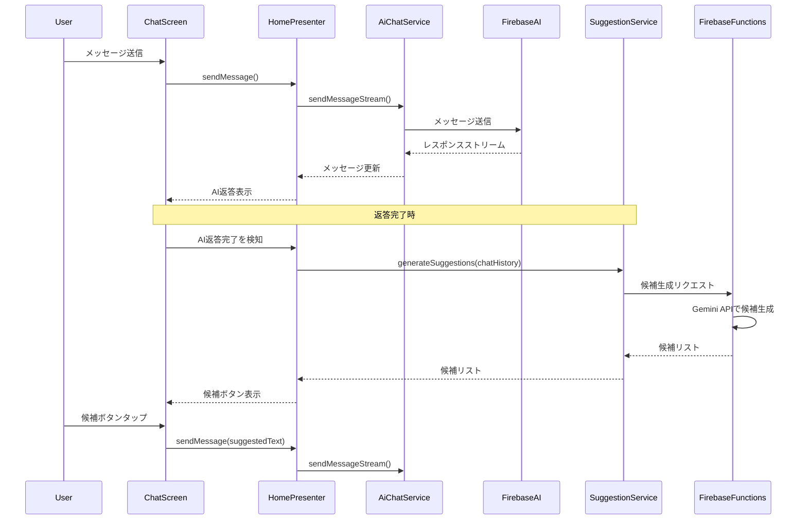

## Overview

AI からの返答表示時に、ユーザーが次に送信しそうな質問や返答を予測し、画面にボタンとして表示する機能を追加する。これにより、ユーザーは提案されたボタンをタップするだけで次のメッセージを送信できるようになり、対話がよりスムーズになる。

### Background and Purpose

**背景:**

- 現在、チャット開始時には静的な質問例が表示されているが、会話が始まった後は手動でテキスト入力する必要がある
- ユーザーが次に何を聞けばよいか迷う場合がある
- モバイルデバイスでのテキスト入力は煩わしい場合がある

**解決したい課題:**

- ユーザーの対話体験を向上させ、会話を継続しやすくする
- テキスト入力の手間を減らし、よりスムーズな対話フローを実現する
- AI が文脈を理解した上で適切な次の質問を提案することで、対話の質を向上させる

### Expected Impact

- ユーザーのメッセージ送信率の向上（特に 2 往復目以降の会話継続率）
- 平均対話ターン数の増加
- テキスト入力による摩擦の軽減

### Feature Description

AI がメッセージを送信した直後に、会話の文脈を分析して次に予想される質問や返答を 3〜5 個生成し、チャット画面の下部にボタンとして表示する。ユーザーがボタンをタップすると、その内容がメッセージとして送信される。

**主要な機能要件:**

1. AI の返答完了時に、文脈に基づいて次の質問候補を自動生成
2. 生成された候補を横スクロール可能なボタンとして表示
3. ボタンタップで即座にメッセージとして送信
4. 候補生成中はローディング状態を表示
5. 生成エラー時は候補は非表示

## User Stories

- As a ユーザー, I want AI の返答後に関連する質問候補が表示される so that 次に何を聞けばよいかわかり、スムーズに会話を続けられる
- As a ユーザー, I want 候補ボタンをタップするだけでメッセージを送信できる so that テキスト入力の手間を省いて素早く返信できる
- As a ユーザー, I want 複数の質問候補から選択できる so that 自分の興味に合った方向で会話を展開できる
- As a 開発者, I want 候補生成ロジックを AI 側に持たせる so that 文脈を考慮した高品質な候補を生成できる

## Architecture Overview

### データフロー



### Component Structure

```
client/lib/
├── data/
│   ├── model/
│   │   └── suggested_reply.dart (新規) - 候補返答のデータモデル
│   ├── service/
│   │   └── suggestion_service.dart (新規) - 候補生成サービス
│   └── repository/
│       └── suggestion_cache_repository.dart (新規) - 候補のキャッシュ管理
└── ui/
    ├── feature/
    │   └── home/
    │       ├── home_presenter.dart (修正) - 候補生成ロジックの追加
    │       └── home_screen.dart (修正) - 候補ボタンの表示
    └── component/
        └── suggested_reply_button.dart (新規) - 候補ボタンコンポーネント

infra/functions/
└── main.py (修正) - 候補生成エンドポイントの追加
```

## Implement Issue List

### Backend (Firebase Functions)

- [ ] 候補生成 API エンドポイント (`generate_suggested_replies`) の実装
  - 会話履歴を受け取り、Gemini API を使用して次の質問候補を 3〜5 個生成
  - レート制限とエラーハンドリングの実装
  - ユニットテストの作成

### Frontend - Data Layer

- [ ] `SuggestedReply` モデルの実装

  - `id`, `text`, `displayText` フィールドを持つ Freezed モデル
  - JSON シリアライゼーション対応

- [ ] `SuggestionService` の実装

  - Firebase Functions の候補生成エンドポイント呼び出し
  - エラーハンドリングとフォールバック候補の提供
  - タイムアウト処理（3 秒）

- [ ] `SuggestionCacheRepository` の実装
  - メモリ内キャッシュによる候補の一時保存
  - セッションごとのキャッシュ管理

### Frontend - UI Layer

- [ ] `SuggestedReplyButton` Component の実装

  - Atomic Design の organisms レベルのコンポーネント
  - タップ時のフィードバックアニメーション
  - アクセシビリティ対応

- [ ] `SuggestedReplyList` Component の実装

  - 横スクロール可能なボタンリスト
  - ローディング状態の表示
  - エラー状態の表示

- [ ] `HomePresenter` の拡張

  - AI 返答完了検知ロジックの追加
  - 候補生成トリガーの実装
  - 候補選択時の送信ロジック

- [ ] `HomeScreen` の UI 更新
  - AI 返答後に候補ボタンエリアの表示
  - メッセージ入力エリアと候補エリアのレイアウト調整
  - アニメーションの追加

### Testing

- [ ] `SuggestionService` のユニットテスト

  - 正常系、異常系、タイムアウトのテストケース

- [ ] `SuggestedReplyButton` のウィジェットテスト

  - タップ動作の検証
  - アクセシビリティの検証

- [ ] `HomePresenter` の統合テスト
  - 候補生成フローの End-to-End テスト
  - モックを使用したテスト

### Documentation

- [ ] 技術設計ドキュメントの作成

  - `doc/design/suggested-replies-feature.md`
  - API 仕様、データモデル、UI/UX フローの詳細

- [ ] 要件定義ドキュメントの更新
  - `doc/requirement/chat-feature.md` への機能追加

## Technical Considerations

### Performance

- 候補生成は非同期で行い、UI をブロックしない
- 生成に 3 秒以上かかる場合はタイムアウトさせ、汎用候補を表示

### Error Handling

- API エラー時はフォールバック候補（「もっと詳しく教えて」「他に教えて」など）を表示
- ネットワークエラー時はユーザーに通知し、候補なしで継続可能

### Privacy & Security

- 会話履歴を外部 API に送信する際は、個人情報をフィルタリング
- Firebase Functions の認証を必須とし、不正アクセスを防止

### UX Design

- 候補ボタンは読みやすいテキストサイズと適切な間隔を確保
- カヴィヴァラのキャラクター性に合ったトーンの候補を生成
- ダークモード対応

## Dependencies

- Firebase Functions の Python 環境（既存）
- Google Generative AI (Gemini) API（既存の AI チャット機能で使用中）
- Flutter パッケージの追加は不要（既存パッケージで実装可能）

## Success Criteria

1. AI 返答完了後、3 秒以内に候補ボタンが表示される
2. 候補ボタンをタップすると、正しくメッセージが送信される
3. エラー時でもアプリがクラッシュせず、適切なフォールバック動作をする
4. 全てのユニットテストとウィジェットテストがパスする
5. コードレビューで指摘された問題がすべて解決されている
