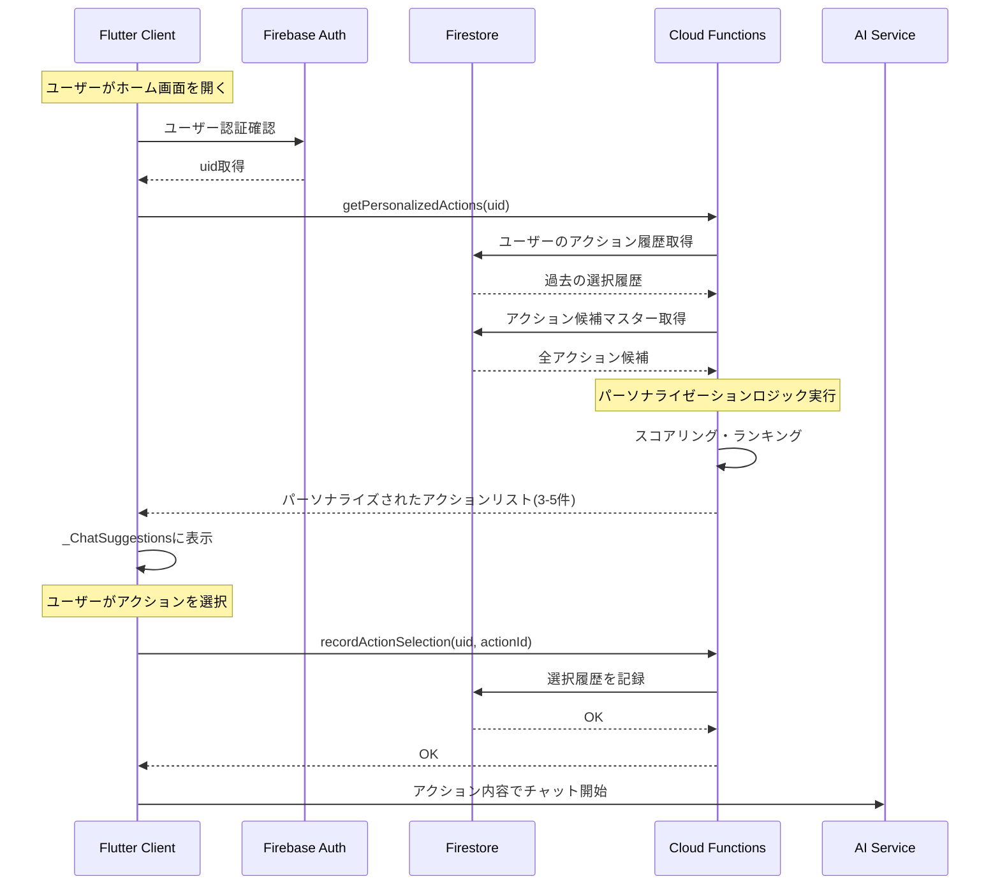

# [Epic] 最初のアクションリストを個人に向けてカスタマイズする

## Overview

現在、チャット画面で初回表示される「質問してみましょう」のアクションリスト(サジェスト)は、全ユーザーに対して同じ固定の 3 つの項目がハードコードされています。この機能を拡張し、ユーザーの行動履歴や興味に基づいてパーソナライズされたアクションリストを提供することで、ユーザーエンゲージメントを向上させます。

### Background and Purpose

**課題:**

- 現在のアクションリスト(`_ChatSuggestions`)は[home_screen.dart:444-457](client/lib/ui/feature/home/home_screen.dart#L444-L457)にハードコードされている
- すべてのユーザーに同じ 3 つの提案が表示されるため、個々のユーザーの興味や利用シーンにマッチしない
- ユーザーが過去に興味を示したトピックや、よく使う相談パターンが反映されていない

**目的:**

- ユーザーの過去のチャット履歴や選択傾向を分析し、パーソナライズされたアクションリストを提供
- エンゲージメント率の向上とユーザー満足度の改善
- 新規ユーザーには適切なデフォルトアクション、既存ユーザーには学習結果を反映

### Expected Impact

- 初回表示アクションリストのクリック率(CTR)の向上: 20%以上の改善を目標
- ユーザーのチャット継続率の向上
- ユーザーごとにカスタマイズされた体験の提供によるリテンション率の改善

### Feature Description

ユーザーごとにパーソナライズされた初回アクションリストを生成・表示する機能を実装します。

**主な機能:**

1. **ユーザーごとのパーソナライゼーション**

   - ユーザーの過去のチャット履歴から興味のあるトピックを推定
   - 選択されたアクションの履歴を記録
   - 時間帯や曜日などのコンテキスト情報を考慮

2. **表示ロジック**

   - 新規ユーザー: デフォルトの人気アクションを表示
   - 既存ユーザー: パーソナライズされたアクションを表示
   - 定期的にアクションをローテーションして新鮮さを保つ

## User Stories

- As a **新規ユーザー**, I want **初めてアプリを開いた時に魅力的なアクション候補を見る** so that **何を質問すれば良いかすぐにわかる**
- As a **既存ユーザー**, I want **自分の興味に合ったアクション候補が表示される** so that **スムーズに会話を始められる**
- As a **頻繁に音楽について相談するユーザー**, I want **音楽関連のアクション候補が優先的に表示される** so that **毎回同じような質問を入力する手間が省ける**
- As a **開発者/管理者**, I want **アクション候補を管理できる** so that **ユーザー体験を継続的に改善できる**

## データフロー

## Implement Issue List

### Backend (Cloud Functions / Firebase)

- [ ] アクション候補マスターデータの Firestore スキーマ設計 (`actions_master` collection)
- [ ] ユーザーごとのアクション選択履歴の Firestore スキーマ設計 (`users/{uid}/action_history` collection)
- [ ] パーソナライズされたアクションリストを取得する API (`getPersonalizedActions`) の実装
- [ ] アクション選択履歴を記録する API (`recordActionSelection`) の実装
- [ ] パーソナライゼーションロジックの実装(スコアリング・ランキングアルゴリズム)
- [ ] デフォルトアクション候補の初期データ投入

### Frontend (Flutter)

- [ ] `ActionSuggestion` モデルクラスの実装 (data/model/)
- [ ] パーソナライズされたアクションを取得する Repository の実装 (`PersonalizedActionRepository`)
- [ ] アクション選択履歴を記録する Repository の実装 (`ActionHistoryRepository`)
- [ ] パーソナライズされたアクションを管理する Service の実装 (`PersonalizedActionService`)
- [ ] `_ChatSuggestions` Widget をパーソナライズ対応に改修(ハードコードから動的取得へ)
- [ ] アクション取得のローディング状態の UI 実装
- [ ] アクション取得エラー時のフォールバック処理(デフォルトアクション表示)
- [ ] パーソナライズされたアクションの Provider 実装 (`personalizedActionsProvider`)

### Testing & QA

- [ ] Backend API の単体テスト(パーソナライゼーションロジック)
- [ ] Frontend Repository/Service の単体テスト
- [ ] `_ChatSuggestions` Widget の Widget テスト(パーソナライズ版)
- [ ] 新規ユーザーでの E2E テスト(デフォルトアクション表示確認)
- [ ] 既存ユーザーでの E2E テスト(パーソナライズされたアクション表示確認)
- [ ] アクション選択履歴の記録確認テスト
- [ ] ネットワークエラー時のフォールバック動作確認

### Documentation

- [ ] アクション候補マスターデータのスキーマドキュメント作成
- [ ] パーソナライゼーションアルゴリズムの設計ドキュメント作成
- [ ] API 仕様書の更新(新規エンドポイント追加)

## Technical Notes

### 現在の実装箇所

- アクションリスト表示: [client/lib/ui/feature/home/home_screen.dart:437-500](client/lib/ui/feature/home/home_screen.dart#L437-L500)
- ハードコード部分: [client/lib/ui/feature/home/home_screen.dart:444-457](client/lib/ui/feature/home/home_screen.dart#L444-L457)
- サジェストリプライ表示(AI 生成): [client/lib/ui/component/suggested_reply_list.dart](client/lib/ui/component/suggested_reply_list.dart)
- Backend functions: [infra/functions/main.py](infra/functions/main.py)

### 既存の関連 Provider

- `SuggestedRepliesProvider`: AI 生成のサジェストを管理 ([client/lib/ui/feature/home/home_presenter.dart:234-250](client/lib/ui/feature/home/home_presenter.dart#L234-L250))
- `PreferenceService`: ローカルストレージのラッパー ([client/lib/data/service/preference_service.dart](client/lib/data/service/preference_service.dart))

### 設計上の考慮事項

1. **パフォーマンス**: 初回ロード時のレイテンシを最小化するため、キャッシュ戦略を検討
2. **フォールバック**: ネットワークエラー時は既存のハードコードされたアクションを表示
3. **プライバシー**: ユーザーのチャット履歴分析は最小限の情報のみ使用
4. **スケーラビリティ**: アクション候補数が増えても効率的に取得できる設計
5. **A/B テスト**: 将来的に A/B テストができるようデータ構造を設計

### 段階的な実装アプローチ

**Phase 1 (MVP):**

- アクション候補マスターの基本実装
- シンプルなランキングロジック(選択回数ベース)
- 既存の `_ChatSuggestions` を動的取得に変更

**Phase 2 (拡張):**

- より高度なパーソナライゼーション(興味カテゴリ分析)
- 時間帯・曜日による最適化
- 管理画面の実装

**Phase 3 (最適化):**

- A/B テスト機能
- 機械学習モデルの統合
- リアルタイム更新

## Dependencies

- Firebase Authentication (既存)
- Cloud Firestore (既存)
- Cloud Functions for Firebase (既存)
- Riverpod (既存の状態管理)

## Risks & Mitigation

**リスク:**

- パーソナライゼーションロジックが複雑化し、レイテンシが増加する可能性
- 新規ユーザーにはデータが不足するため、効果が限定的

**対策:**

- キャッシュ戦略とプリフェッチの活用
- 新規ユーザーには厳選されたデフォルトアクションを提供
- 段階的なロールアウトと A/B テストによる効果測定
